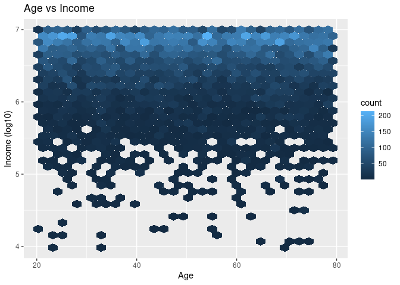

Loan Defaulting Investigation
================
Amigos

``` r
library(tidyverse)
library(broom)
library(ggridges)
Loans <- read.csv("/cloud/project/data/Loans.csv")
```

*For instructions on what each section should include, please see the
[project page](https://idsed.digital/assessments/project/#proposal) on
the course website. Remove this text when completing your proposal*.

## 1. Introduction

How does a person’s situation and current status affect Loan Defaulting.
Our data shows observations gathered for different individuals in India
related to their current status in life and whether they were able to
repay a loan or not. We found our dataset from “kaggle.com” and it
dataset belongs to a Hackathon organized by “Univ.AI”!!. All values were
provided at the time of the loan application. Also, the cases can be
described as Indian people applying for a loan and the variables used
include several status situations of the applicants like, Income, Age
and Marital status, but also describe parts of their lifestyle, such as
Home and Car Ownership.

## 2. Data

``` r
glimpse(Loans)
```

    ## Rows: 28,000
    ## Columns: 13
    ## $ ID                <int> 1, 2, 3, 4, 5, 6, 7, 8, 9, 10, 11, 12, 13, 14, 15, 1…
    ## $ risk_flag         <int> 0, 0, 1, 0, 0, 0, 0, 0, 0, 1, 0, 0, 0, 0, 0, 0, 0, 0…
    ## $ Income            <int> 7393090, 1215004, 8901342, 1944421, 13429, 3437621, …
    ## $ Age               <int> 59, 25, 50, 49, 25, 78, 55, 70, 43, 65, 71, 51, 61, …
    ## $ Experience        <int> 19, 5, 12, 9, 18, 14, 0, 15, 7, 5, 14, 13, 13, 15, 2…
    ## $ Married.Single    <chr> "single", "single", "single", "married", "single", "…
    ## $ House_Ownership   <chr> "rented", "rented", "rented", "rented", "rented", "r…
    ## $ Car_Ownership     <chr> "no", "no", "no", "yes", "yes", "no", "no", "yes", "…
    ## $ Profession        <chr> "Geologist", "Firefighter", "Lawyer", "Analyst", "Co…
    ## $ CITY              <chr> "Malda", "Jalna", "Thane", "Latur", "Berhampore", "R…
    ## $ STATE             <chr> "West Bengal", "Maharashtra", "Maharashtra", "Mahara…
    ## $ CURRENT_JOB_YRS   <int> 4, 5, 9, 3, 13, 3, 0, 14, 6, 3, 5, 7, 11, 13, 14, 2,…
    ## $ CURRENT_HOUSE_YRS <int> 13, 10, 14, 12, 11, 10, 14, 13, 13, 12, 10, 10, 12, …

## 3. Data analysis plan

Our research question will entail using age as the explanatory variable
and given individual’s income as the response variable. We will also be
using comparison groups; Married/Single and Risk\_Flag (0 or 1), to see
whether some of or even all of them affect defaulting on a loan or not.
Our goal is to see whether a correlation exists. The statistical methods
that will allow us to represent the data in the best possible way, in
order to answer our question are by the use of the function “Median”,
the formation of graphs, like scatter plots or density plots and
specifically through the use of facet wrapping and filling (coloring),
we will be able to compare all the variables mentioned and attempt to
find a correlation. We will try to see if there is a positive
correlation, at first, between age and income, so if as an individual
becomes older, his/her income rises (possibly due to work experience).
Secondly, we will investigate, whether a person earning a substantially
higher income (income higher than the median income), helps in paying
back the loan. Finally, we would like to see if being married helps
people pay back their loans, since there is support from a husband or a
wife and therefore more money is available in paying back the loan.

``` r
Loans %>%
  ggplot() +
  geom_hex(aes(x = Age, y = log10(Income))) +
  ggtitle("Age vs Income") +
  ylab("Income (log10)")
```

    ## Warning: Computation failed in `stat_binhex()`:
    ## The `hexbin` package is required for `stat_binhex()`

<!-- -->
